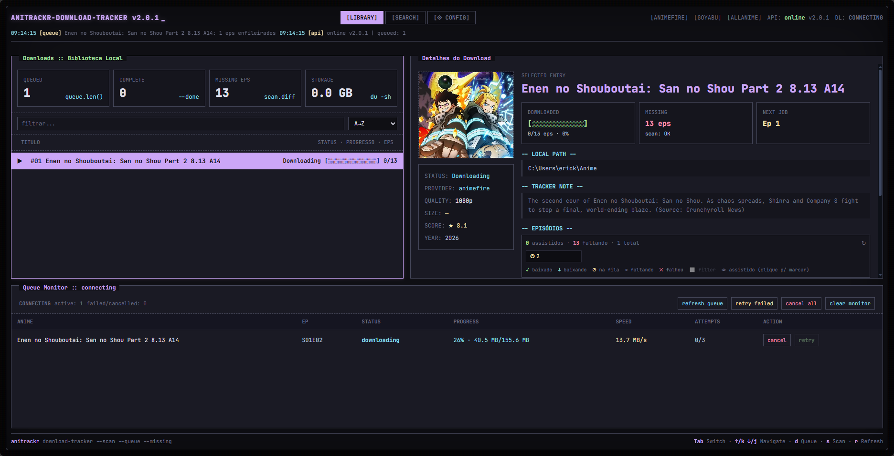
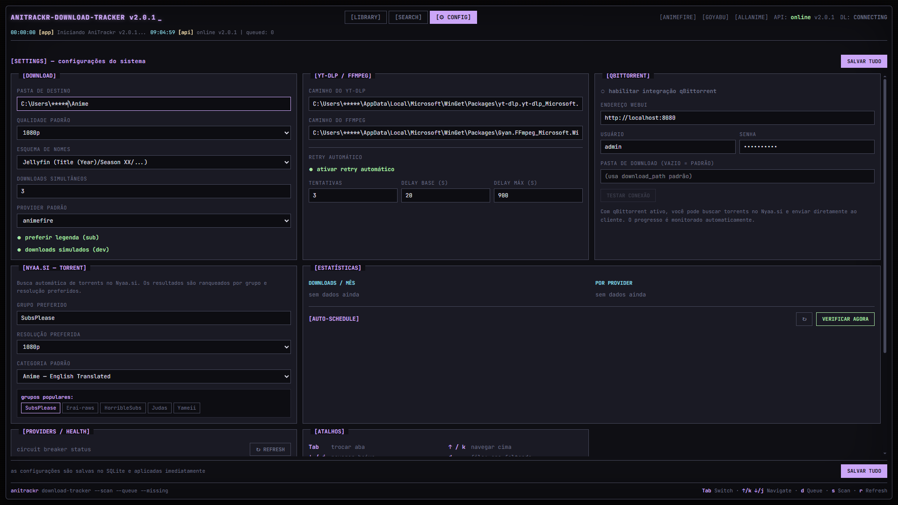
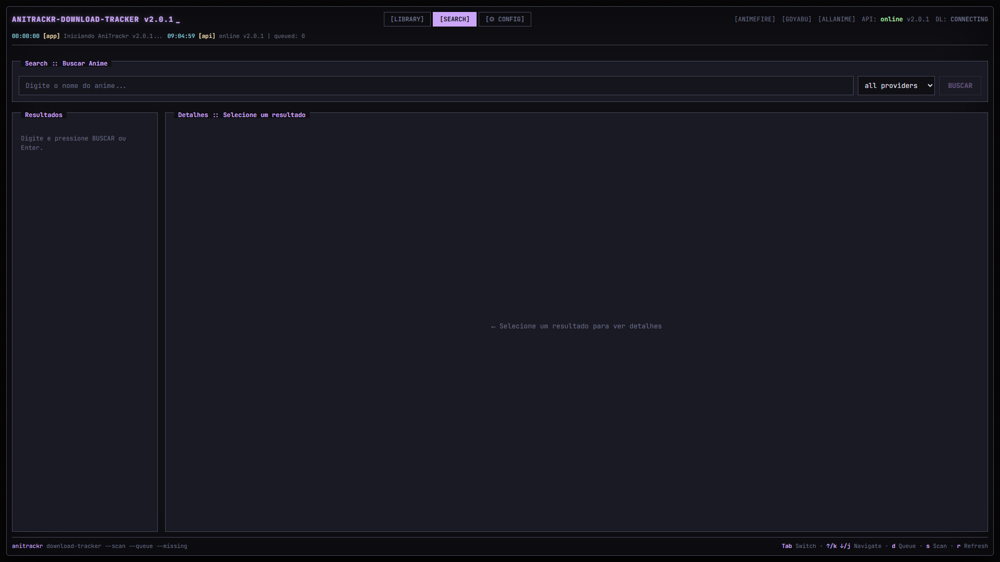

# AniTrackr


Painel local para buscar, baixar e rastrear episodios de anime com frontend em Next.js e backend em Elysia.

## Screenshots





## O que o projeto faz

- Busca anime em multiplos providers (`allanime`, `animefire`, `goyabu`, `nineanime`, `animedrive`, `superflix`, `dattebayo`, `kitsu`).
- Lista episodios, permite selecionar em lote e cria fila de download.
- Suporta download por stream (`yt-dlp`) e por torrent (`qBittorrent` + Nyaa/AniRena).
- Mantem biblioteca local em SQLite, com progresso por episodio.
- Exibe fila em tempo real via SSE com acoes de retry/cancel.
- Faz enriquecimento de metadados (Kitsu, AniList e Jikan/MAL).

## Stack

- Runtime: `bun@1.3+`
- Frontend: Next.js 16 + React 19 + Tailwind 4
- Backend: Elysia + TypeScript
- Banco: SQLite (`bun:sqlite`)

## Requisitos

- Bun 1.3+
- `yt-dlp` no PATH
- `ffmpeg` no PATH
- qBittorrent com WebUI (opcional, para torrents)

## Quick Start

```bash
git clone https://github.com/eoNaho/AniTrackr.git
cd AniTrackr
bun install
bun run dev
```

Servicos locais:

- Web: `http://localhost:3000`
- API: `http://localhost:3001`
- Health: `http://localhost:3001/health`

## Docker

```bash
bun run docker:up
bun run docker:logs
```

Servicos da stack Docker:

- Web: `http://localhost:3000`
- API: `http://localhost:3001`
- qBittorrent WebUI: `http://localhost:8080`

Volumes persistentes:

- `anitrackr_data` -> banco SQLite
- `anitrackr_downloads` -> arquivos baixados
- `anitrackr_qbt_config` -> config do qBittorrent

Nota para torrents no Docker:

- O backend passa a usar `http://qbittorrent:8080` internamente.
- No navegador/host, a WebUI fica em `http://localhost:8080`.
- No primeiro boot do container do qBittorrent, confira `docker compose logs qbittorrent` para obter a senha temporaria do WebUI e depois ajuste as credenciais no app se necessario.

## Fluxo de uso

1. Abra `Search`, pesquise por titulo e escolha um resultado.
2. Carregue episodios e selecione o range desejado.
3. Envie para a fila (`/api/queue`).
4. Acompanhe status na fila em tempo real.
5. Veja progresso consolidado em `Library`.

## Endpoints principais

### Search

- `GET /api/search?q=<nome>&source=<provider|all>`
- `GET /api/search/episodes?animeId=<id>&source=<provider>`
- `GET /api/search/providers`

### Download

- `GET /api/downloads`
- `GET /api/downloads/stream` (SSE)
- `POST /api/queue`
- `POST /api/downloads/:id/retry`
- `DELETE /api/downloads/:id`

### Library

- `GET /api/library`
- `POST /api/library`
- `GET /api/library/:id/episodes`
- `POST /api/library/:id/scan`

### Config

- `GET /api/config`
- `POST /api/config`
- `GET /api/config/:key`
- `PUT /api/config/:key`

## Configuracao minima recomendada

Chaves importantes em `/api/config`:

- `download_path`
- `quality`
- `sub_lang`
- `allow_simulated_downloads`
- `provider_priority`
- `default_search_source`

Exemplo:

```json
{
  "download_path": "/downloads",
  "quality": "1080p",
  "sub_lang": "pt-BR",
  "allow_simulated_downloads": "false",
  "default_search_source": "all",
  "qbittorrent_host": "http://qbittorrent:8080"
}
```

## Estrutura do monorepo

```txt
apps/
  backend/   # API Elysia + servi�os + SQLite
  web/       # UI Next.js
image/       # screenshots usadas neste README
```

## Troubleshooting rapido

- API offline: valide `http://localhost:3001/health`.
- Busca sem resultados: troque `source` para `all` e confira status dos providers em `/api/providers/health`.
- Download falhando: confirme `yt-dlp`, `ffmpeg` e permissao em `download_path`.
- Torrent sem progresso: teste credenciais/host do qBittorrent em `/api/torrent/status`.

## Licença

Este projeto está licenciado sob a [GNU Affero General Public License v3.0 (AGPL-3.0)](LICENSE). Veja o arquivo "LICENSE" para mais detalhes.
